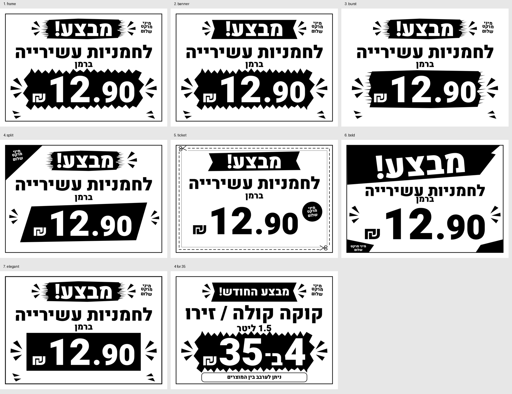

# Outdoor v1.4 visual review

The seven A4 landscape signs below were rendered from the actual Canvas code with dynamic product data. They were compared visually with the user's approved reference before merging: dense black/white supermarket typography, oversized prices, brush banners, irregular price explosions, rays, diagonal corners and coupon cutting lines.

No reference bitmap or product photo is embedded in the signs. The bundled OFL Heebo font is used only for outdoor signs. Marketing claims and invented deadlines have been removed; final content comes from the user's fields.

Full-resolution examples (1754 × 1240):

1. [Sale star](template-frame.png)
2. [Price explosion](template-banner.png)
3. [Brush](template-burst.png)
4. [Split](template-split.png)
5. [Coupon](template-ticket.png)
6. [Large price](template-bold.png)
7. [Bold minimal](template-elegant.png)
8. [Coca-Cola / Zero — 4 for ₪35](outdoor-coke-4-for-35.png)

Regenerate the images with `node tests/capture-review.mjs`. The browser suite checks complete long/short names, quantity offers, blank-form sample thumbnails, user-only labels, A4 safe bounds, saved drafts, exact preview/PNG/native-print canvas equality and the exact preview JPEG embedded in each PDF. Test artifacts include both Chromium and WebKit results and exports.

The review corrected a currency/corner collision in the large-price design and subtitle collisions in the coupon/split designs. Price digits and bundle quantity remain full-sized; long product names can occupy three lines before shrinking.

Physical printer hardware and the operating system's share sheet require a real device; browser printing and file payloads are verified by the automated suite.

Final validation: 28 unit tests passed; 3,460 browser assertions passed in Chromium and WebKit. All 24 indoor comparisons against the untouched v1.3 baseline were pixel-identical. See [browser results](browser-results.json) and [indoor results](indoor-baseline-results.json). CI configuration is unchanged.
